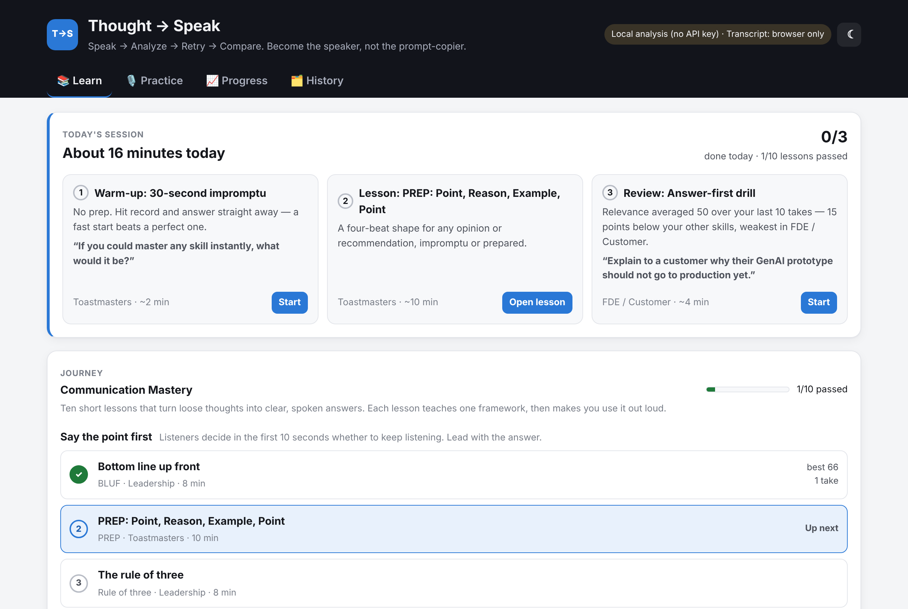
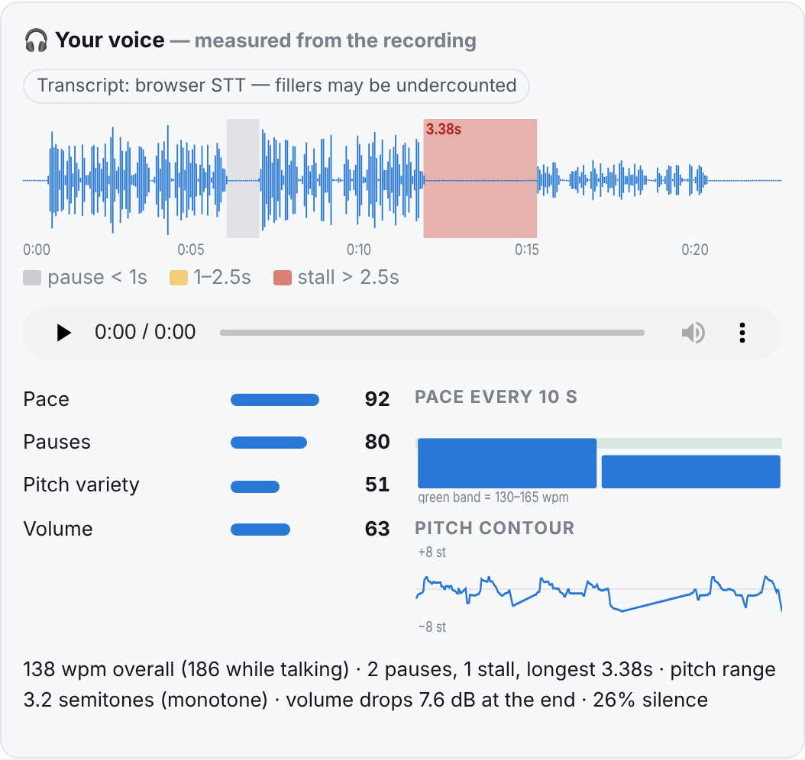
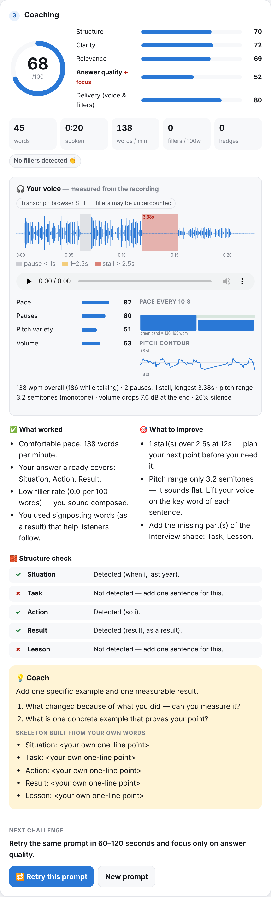
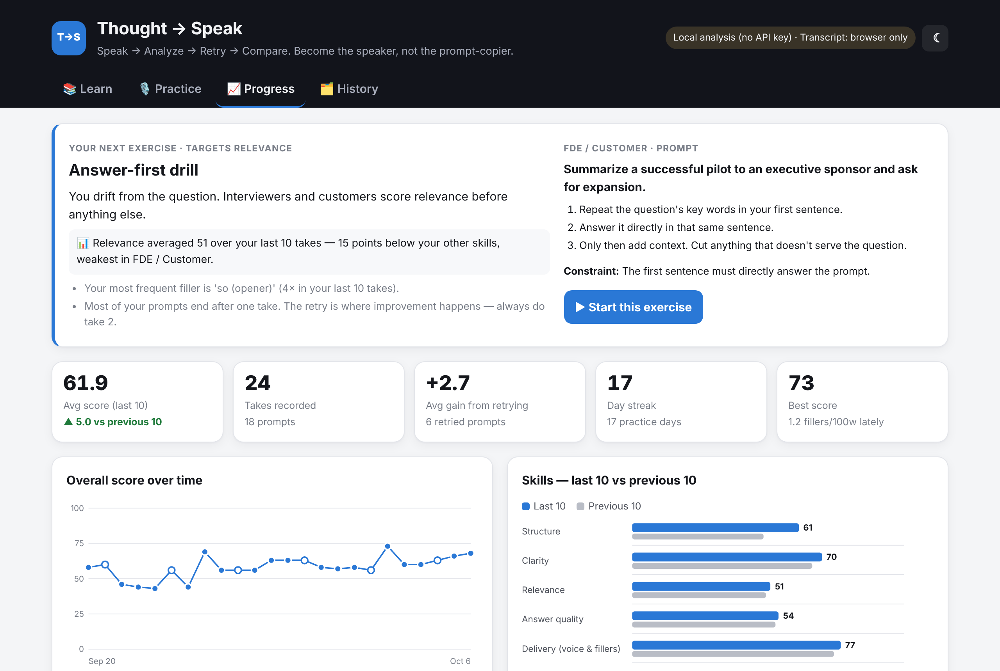
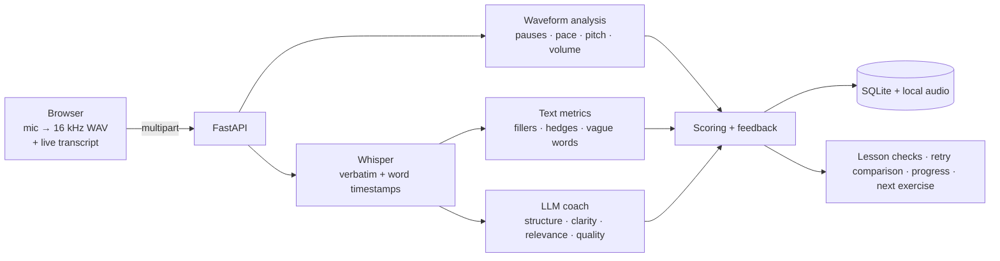

# Thought → Speak

**A personal AI communication coach that listens to how you actually speak.**
Learn a framework → answer out loud → get coached on content *and* voice → retry → compare.



Most people don't have a knowledge problem — they have an articulation problem. You know the answer,
but under pressure it comes out as background first, point last, with a few "um"s in between.
Thought → Speak is built to close that gap, and to make you *less* dependent on AI, not more:
in Challenge Mode it coaches with questions and never writes your answer for you.

## Features

**Learn**
- *Communication Mastery* journey — 10 short lessons in 3 modules: BLUF, PREP, Rule of three,
  Pause-don't-fill, Acknowledge–Bridge–Answer, What / So what / Now what, STAR, the abstraction ladder,
  precise words, and landing the ending.
- Each lesson: concept → framework card → cheat sheet → before/after example → spoken exercise with
  explicit pass criteria. Your answer is scored against *that lesson's* framework.
- **Today's session (~15 min):** a no-prep warm-up, your current lesson, and a review drill on your weakest skill.

**Practice**
- Five scenarios — Interview, Leadership, Technical explanation, Toastmasters, FDE / Customer — or your own prompt.
- Scores for **structure, clarity, relevance, answer quality and delivery**, plus a framework check.
- **Retry loop:** retries are chained to the same prompt and compared take by take.
- **Challenge Mode:** Socratic questions and a hint only; the server strips any outline or rewrite.

**Your voice — measured from the recording, not the transcript**



| Metric | How it's measured |
|---|---|
| Pauses: natural (< 1 s), long (1–2.5 s), **stalls** (> 2.5 s) | energy-based voice activity detection on 20 ms frames, adaptive noise floor |
| Pace overall, while talking, and every 10 s | speaking window + Whisper word timestamps |
| **Pitch variety** (monotone / limited / expressive) | autocorrelation F0 tracking (75–400 Hz), range in semitones |
| Volume consistency and **trailing off** | speech-frame dB, last 15 % vs. the body |
| Fillers that speech-to-text usually deletes | Whisper with a disfluent prompt so "um / uh" are kept |

**Progress** — score trend, skills last-10 vs. previous-10, average gain from retrying, streak,
per-scenario stats, top filler words, and a personalised next exercise.

| Coaching | Progress |
|---|---|
|  |  |

## Quick start

```bash
git clone https://github.com/<your-user>/thought-to-speak.git
cd thought-to-speak
python -m venv .venv && source .venv/bin/activate      # Windows: .venv\Scripts\activate
pip install -r requirements.txt
cp .env.example .env                                   # optional: add OPENAI_API_KEY
uvicorn app:app --reload
```

Open <http://127.0.0.1:8000> in Chrome or Edge (live transcript). The microphone works only on `localhost` or HTTPS.

**Optional — free offline transcription:** `pip install -r requirements-whisper.txt` installs
[faster-whisper](https://github.com/SYSTRAN/faster-whisper); the `base.en` model (~140 MB) downloads on first use.

| `.env` setting | Effect |
|---|---|
| none | Works fully offline: local heuristic scoring + waveform analysis + browser transcript |
| `OPENAI_API_KEY` | AI coaching feedback and Whisper API transcription |
| `ANTHROPIC_API_KEY` | AI coaching feedback via Claude (used when no OpenAI key is set) |
| `LLM_PROVIDER`, `TRANSCRIBE_PROVIDER` | Force `openai` / `anthropic` / `local` / `none` |

## How it works



Design choices:
- **LLMs judge, code counts.** Fillers, hedges, pace, pauses and pitch are computed deterministically; the model
  only scores content. If the LLM call fails, you get local analysis instead of an error.
- **Delivery = 40 % words + 60 % voice.**
- **Lessons are data.** Each `content/*.json` file is a journey, validated at startup. Pass checks can use
  `overall`, `framework_coverage`, `scores.*`, `metrics.*` or `voice.*`.
- **Private by default.** History and recordings stay in `data/` on your machine. Transcripts go to your AI
  provider only if you configure one. Chrome's live transcript uses Google's speech service.

```
app.py               FastAPI routes
coach/analysis.py    heuristic + LLM analysis, Challenge Mode guard
coach/audio.py       waveform analysis and voice scores (numpy)
coach/transcribe.py  Whisper: OpenAI API or local faster-whisper
coach/metrics.py     fillers, hedges, vague words, WPM
coach/curriculum.py  journeys, lesson pass checks, daily plan
coach/insights.py    retry comparison, progress, recommendation
coach/storage.py     SQLite + migrations
content/             lessons (JSON)
static/              UI — plain HTML/CSS/JS, no build step
tests/               pytest
```

## Tests

```bash
pip install -r requirements-dev.txt
pytest -q
```

## Limitations

- Pitch tracking and pause detection are signal-processing heuristics, not trained models; background noise
  lowers accuracy (the app warns when the recording is quiet or noisy).
- Without an API key, content scores are keyword heuristics — directional, not precise.
- Single-user, local app. Multi-user deployment would need auth, per-user storage and rate limiting.

## Roadmap

- Follow-up interviewer agent that probes your answer in real time
- "Idea spark" hints that fade as you improve
- AI-generated prompts tailored to a role or job description
- Conversation simulator (small talk, difficult customer)

See [CHANGELOG.md](CHANGELOG.md) for version history.

## License

[MIT](LICENSE)
